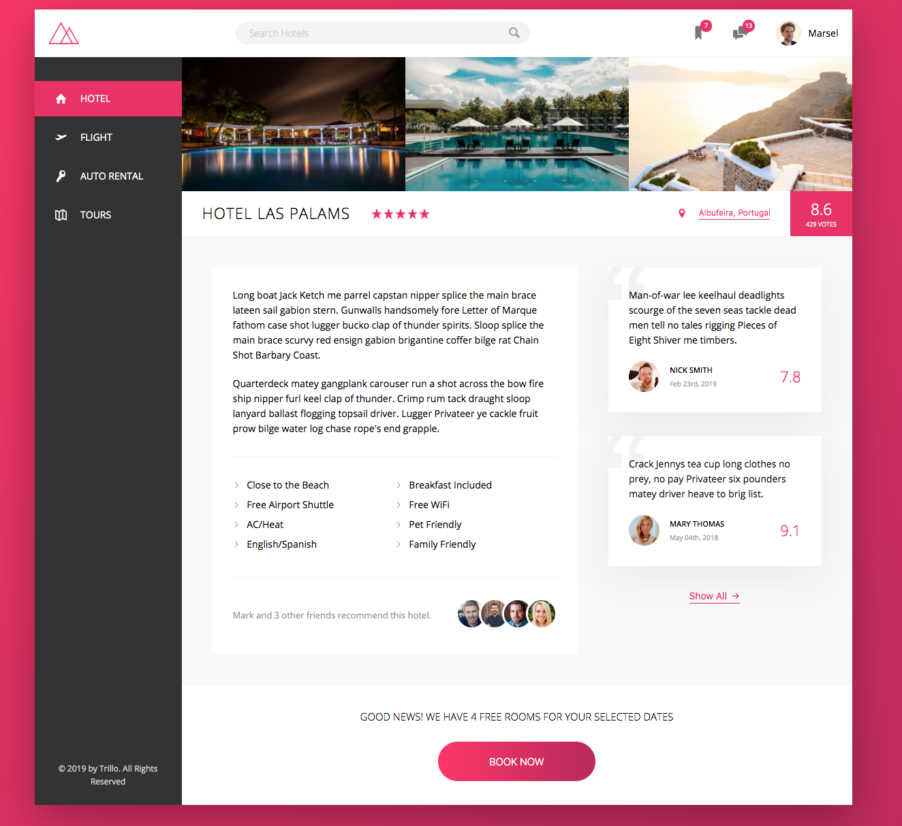
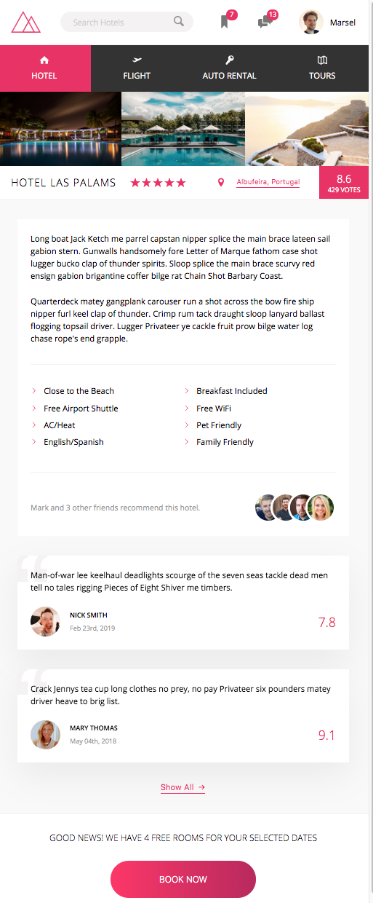

# Trillo

This is an advanced CSS and Sass project that uses Flexbox.

### Planning/ Execution:
1. Global styles/ resets/ layouts
2. Header
3. Navigation SideBar
4. Hotel Overview Section
5. Description Section
6. Reviews SideBar
7. Call to Action Section
8. Media Queries

### Advanced CSS and Sass Concepts used:
1. :root selector 
> [Read More About the Root Selector](https://css-tricks.com/almanac/selectors/r/root/)

2. FlexBox
> (See Notes Below)

3. SVGs -- Scalable Vector Graphics
> SVGs are preferred since they are easily to manipulate and have better support than iconfonts.

4. Nested FlexBoxes

5. currentColor
> The current of the parent element.

6. Animations

7. Masks
> Adds crop and/or cross marks to the presentation of the document. Crop marks indicate where the page should be cut. Cross marks are used to align sheets.

###  Notes
FlexBox Definition and Terms:

**Flex:**
>Instead of writing flex-grow, flex-basis, flex-shrink you can simply write flex where the first item is flex-grow, the second if flex-shrink, and the final is flex-basis. 
```
/* this */
flex: 1 100px;

/* is the same as */
flex-grow: 1;
flex-basis: 100px;

/* and it leaves the flex-shrink property alone, which would be */
flex-shrink: inherit; /* defaults to 1 */
```


### Final Product:

**Desktop**



**Mobile**

<!--  -->

#### Future Developers:
`npm install`

`live-server` to run live server

`npm start` to compile sass into css && watch for changes

ENJOY!